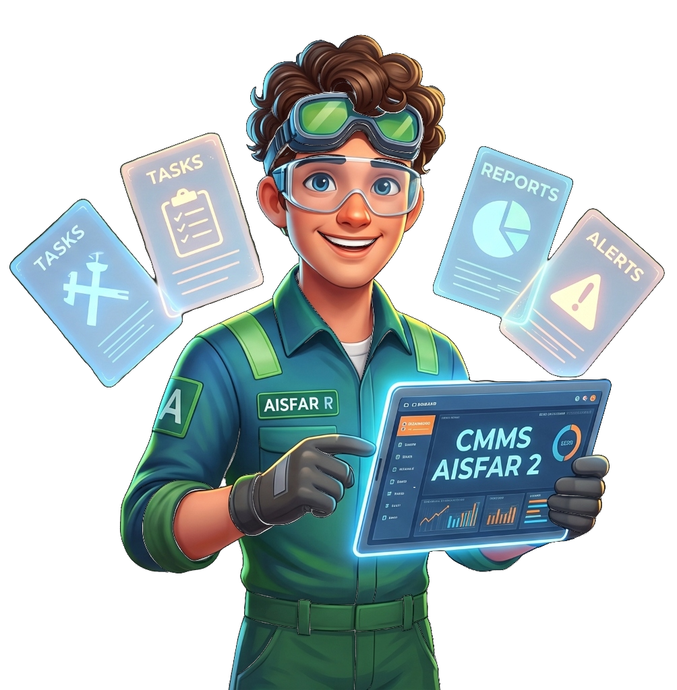
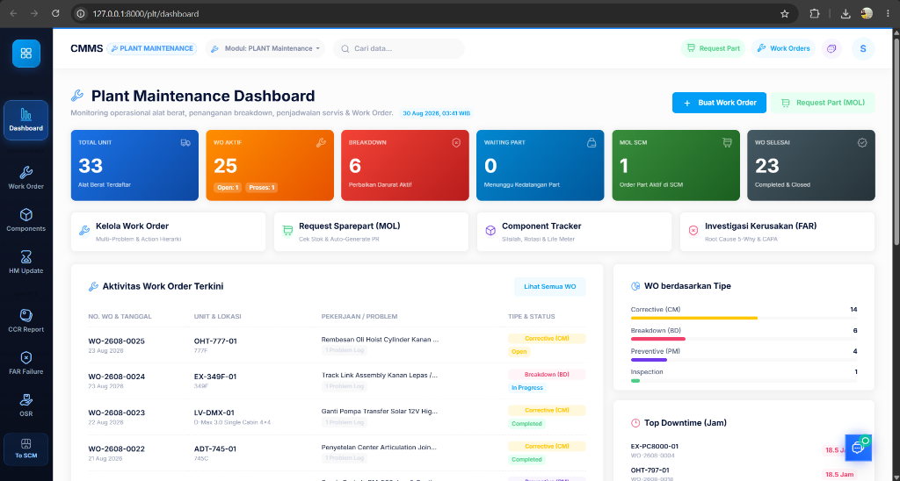
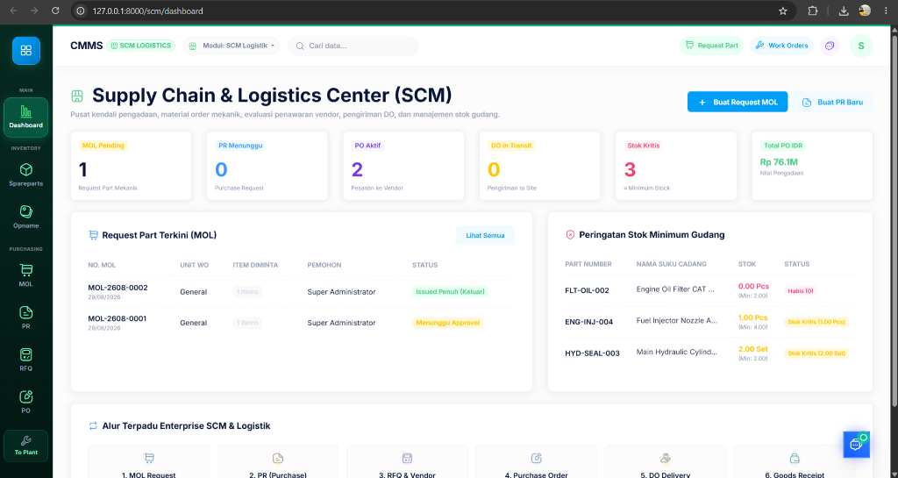
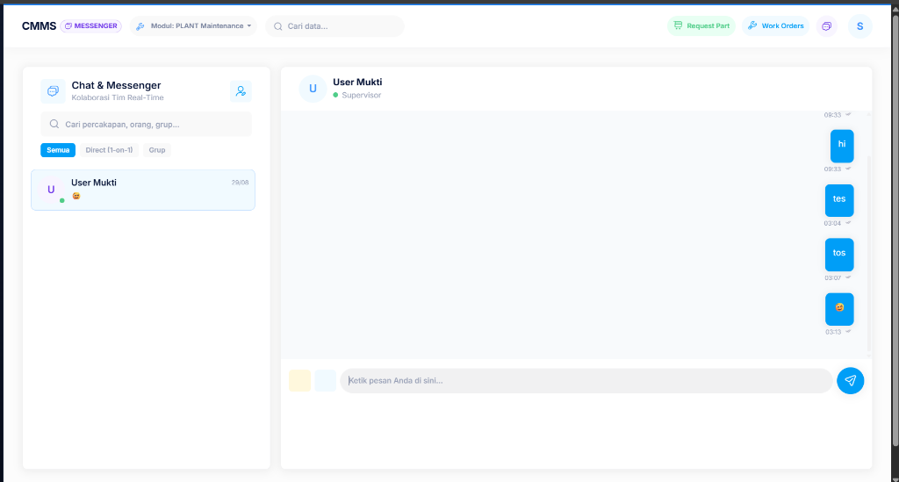
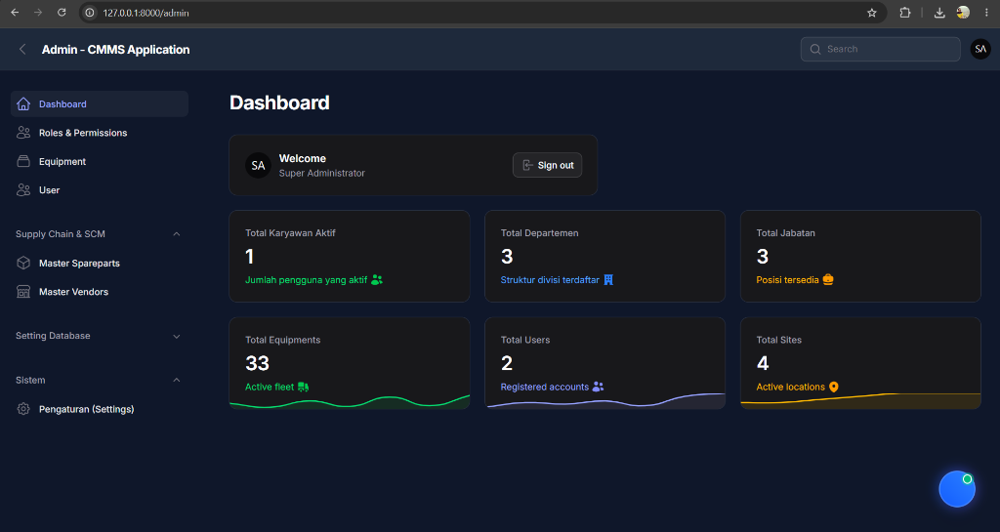
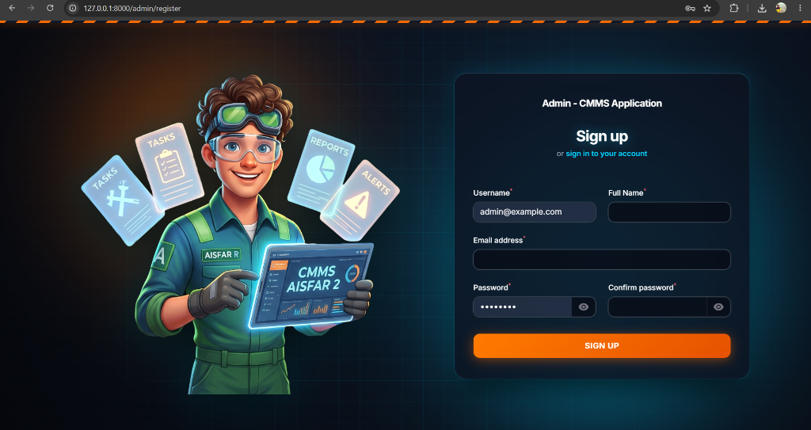
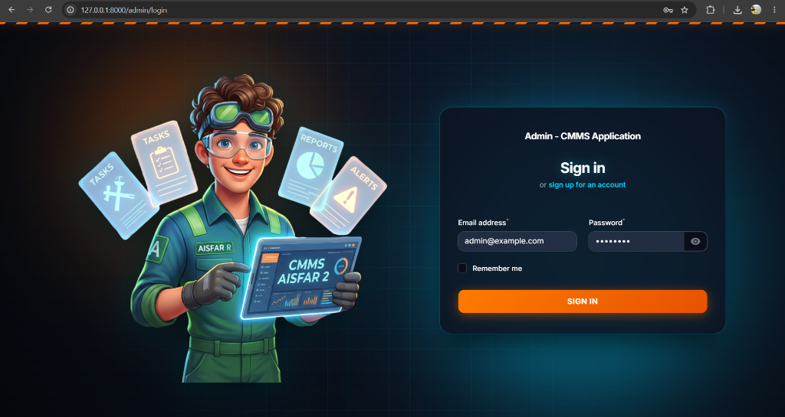

<div align="center">



# ⚙️ CMMS AISFAR V2
### Enterprise Heavy Equipment, Plant Maintenance & Supply Chain Management System

[](https://php.net)
[](https://laravel.com)
[](https://livewire.laravel.com)
[](https://filamentphp.com)
[](LICENSE)

<p align="center">
  <strong>Sistem Manajemen Pemeliharaan Terpadu & Rantai Pasok Khusus Alat Berat, Armada Industri, dan Pertambangan.</strong>
</p>

[Fitur Utama](#-fitur-utama) • [Modul Sistem](#-modul-sistem) • [Screenshots](#-screenshots) • [Instalasi](#-panduan-instalasi) • [Teknologi](#-teknologi)

---

</div>

## 📖 Tentang Aplikasi

**CMMS AISFAR V2** adalah aplikasi *Computerized Maintenance Management System* (CMMS) modern berbasis web yang dirancang khusus untuk mengoptimalkan:

- 🔧 **Keandalan Armada** *(Equipment Reliability)* — Work Order hierarkis, status unit real-time, dan pelacakan breakdown
- ⚙️ **Siklus Hidup Komponen** *(Component Lifecycle)* — Life Meter, rotasi komponen, dan CCR berkala
- 🔍 **Investigasi Kegagalan** *(Failure Analysis)* — 5-Why RCA, Fishbone CAPA, dan estimasi kerugian jam downtime
- 📦 **Rantai Pasok Suku Cadang** *(SCM Logistics & Procurement)* — Dari MOL → PR → RFQ → PO → DO → GR
- 💬 **Komunikasi Tim** — Real-time messenger terintegrasi antar departemen PLT dan SCM
- 🛡️ **Administrasi & RBAC** — Role-based access control granular via Filament Admin Panel

---

## 🌟 Fitur Utama

```
                          ┌──────────────────────────────────────────────────────┐
                          │             CMMS AISFAR V2 ECOSYSTEM                 │
                          └──────────────────────┬───────────────────────────────┘
                                                 │
       ┌──────────────────┬─────────────────────┼─────────────────────┬──────────────────┐
       ▼                  ▼                      ▼                     ▼                  ▼
 [PLANT /plt]        [SCM /scm]           [CHAT /chat]          [ADMIN /admin]      [AUTH]
 Work Order (WO)     Master Spareparts    Direct 1-on-1         RBAC Roles          Login
 Component Tracker   Stock Opname         Group Channels        User Management     Register
 CCR (Kondisi)       MOL → PR → RFQ       File Attachments      Equipment Master    Branded UI
 FAR (5-Why/CAPA)    PO → DO → GR         Floating Widget       General Settings    Mascot Theme
 OSR (Workshop)      Reorder Point Alert  Real-Time Notif.      Activity Log        Dark Glass
```

---

## 🚀 Modul Sistem

---

### 🛠️ 1. Modul PLANT Maintenance — `/plt`

> **Tema**: Deep Royal Midnight Slate · Aksen Electric Blue · Dashboard operasional alat berat penuh informasi.



**Plant Maintenance Dashboard** adalah pusat komando operasional teknisi dan planner dalam mengelola seluruh pekerjaan pemeliharaan alat berat. Pada screenshot di atas, tampak ringkasan KPI utama departemen PLT secara real-time:

| Kartu Statistik | Nilai | Arti |
|---|---|---|
| **Total Unit** | 33 | Jumlah seluruh alat berat terdaftar dalam armada |
| **WO Aktif** | 25 | Work Order yang sedang berjalan (Open: 1, Proses: 1) |
| **Breakdown** | 6 | Perbaikan darurat aktif yang memerlukan perhatian segera |
| **Waiting Part** | 0 | WO yang tertahan karena menunggu kedatangan suku cadang |
| **MOL SCM** | 1 | Order Part yang sedang aktif diproses di departemen SCM |
| **WO Selesai** | 23 | Work Order yang telah Completed & Closed |

**Sub-modul utama PLANT:**

- **🔧 Work Order Management** — Perintah kerja hierarkis (Problem → Task → Subtask), pelacakan status kesiapan unit (*Open, In Progress, Completed*), alokasi suku cadang per WO, dan penanganan *Corrective (CM), Breakdown (BD), Preventive (PM), dan Inspection*.

- **⚙️ Component Tracker & Lifecycle** — Pelacakan silsilah posisi komponen putar (*Engine, Transmission, Hydraulic Pump, Final Drive*). Dilengkapi **Life Meter** jam kerja berjalan vs target umur komponen, serta histori transaksi rotasi/swap komponen.

- **📋 CCR - Component Condition Report** — Evaluasi berkala kondisi fisik komponen (*Wear %, kebocoran, getaran, kebersihan oli*). Rekomendasi tindakan planner dan **1-Click Auto Work Order** dari temuan kritis CCR.

- **🔍 FAR - Failure Analysis Report** — Investigasi kegagalan dini atau breakdown fatal dengan formulir **5-Why Root Cause Analysis**, Fishbone Diagram, perumusan CAPA, dan estimasi kerugian biaya & jam downtime.

- **🏭 OSR - Outside Repair Order** — Surat Perintah Kerja Keluar untuk vendor subkontrak (bubut, hardchroming, line boring, rewinding), pelacakan surat jalan kirim/terima, QC sign-off, dan pencatatan garansi vendor.

**Grafik WO berdasarkan Tipe** (kanan bawah) menunjukkan distribusi pekerjaan: Corrective (CM) mendominasi dengan 14 WO, diikuti Breakdown (BD) 6 WO, Preventive (PM) 4 WO, dan Inspection 1 WO — sehingga planner dapat memprioritaskan strategi pemeliharaan yang tepat.

---

### 📦 2. Supply Chain & Logistics Center — `/scm`

> **Tema**: Deep Forest Jade Slate · Aksen Emerald Green · Pusat kendali pengadaan dan manajemen stok gudang.



**SCM Dashboard** merupakan pusat kendali end-to-end mulai dari permintaan suku cadang mekanik di lapangan hingga penerimaan barang fisik di gudang. Pada screenshot di atas, tampak status pipeline SCM secara real-time:

| Kartu Statistik | Nilai | Arti |
|---|---|---|
| **MOL Pending** | 1 | Request Part Mekanik yang belum diproses |
| **PR Menunggu** | 0 | Purchase Request yang belum diajukan ke Purchasing |
| **PO Aktif** | 2 | Pesanan Pembelian yang sedang aktif ke Vendor |
| **DO Transit** | 0 | Pengiriman yang sedang dalam perjalanan ke Site |
| **Stok Kritis** | 3 | Item suku cadang di bawah batas minimum gudang |
| **Total PO IDR** | Rp 76.1M | Total nilai pengadaan aktif |

**Alur Terpadu Enterprise SCM (6 Tahap):**

```
MOL Request  →  PR (Purchase)  →  RFQ & Vendor  →  Purchase Order  →  DO Delivery  →  Goods Receipt
    [1]              [2]               [3]               [4]               [5]              [6]
  Mekanik          SCM Officer      Purchasing         Purchasing         Logistik         Gudang
 Ajukan Part     Buat Pengajuan   Bandingkan Vendor   Terbitkan PO     Kirim ke Site    Terima & Catat
```

**Sub-modul utama SCM:**

- **📑 MOL - Mechanic Order Part** — Formulir permintaan suku cadang mekanik berbasis WO. **Smart Partial Issue**: jika stok gudang hanya tersedia sebagian, gudang mengeluarkan stok yang ada dan **otomatis meneruskan kekurangan menjadi PR** tanpa input manual.

- **🗃️ Master Spareparts & Stock** — Katalog suku cadang lengkap dengan multi-lokasi rak gudang *(Rack/Bin Location)*, batas minimum stok *(Reorder Point)*, dan histori vendor. Panel **Peringatan Stok Minimum** menampilkan item kritis beserta status *Habis/Stok Kritis* secara real-time.

- **📊 PR → RFQ → PO** — Pipeline pengadaan: Purchase Request → Request for Quotation (perbandingan harga vendor) → Purchase Order resmi ke vendor terpilih.

- **🚚 DO → GR** — Delivery Order manajemen surat jalan pengiriman + Goods Receipt validasi penerimaan fisik dengan penambahan stok otomatis ke gudang.

- **📦 Stock Opname** — Perhitungan stok fisik periodik, kalkulasi selisih *(discrepancy)*, dan generate Berita Acara Opname.

---

### 💬 3. Chat & Messenger — `/chat`

> **Tema**: Clean White Card · Aksen Royal Blue · Kolaborasi tim real-time lintas departemen.



**Chat & Messenger** adalah platform komunikasi internal real-time yang menghubungkan seluruh tim PLT, SCM, dan manajemen tanpa perlu aplikasi pihak ketiga. Fitur lengkap:

- **Direct 1-on-1 Chat** — Percakapan pribadi langsung antar pengguna, dilengkapi indikator status online (hijau) dan waktu pesan terakhir.
- **Group Channels** — Saluran grup untuk koordinasi tim workshop, diskusi breakdown, atau rapat virtual koordinasi PLT-SCM.
- **Tab Filter** — Filter percakapan berdasarkan *Semua*, *Direct (1-on-1)*, atau *Grup* untuk memudahkan navigasi.
- **Pencarian Real-Time** — Cari percakapan, nama orang, atau grup secara instan.
- **Floating Chat Widget** — Tersedia di seluruh halaman modul PLT dan SCM sebagai widget biru mengambang (pojok kanan bawah) untuk akses cepat tanpa meninggalkan halaman kerja.
- **Notifikasi Pesan** — Badge jumlah pesan belum terbaca pada icon chat di navbar.

---

### ⚙️ 4. Dashboard Admin — `/admin`

> **Tema**: Filament Dark Mode · Sidebar navigasi · Panel administrasi penuh konfigurasi sistem.



**Admin Panel** adalah pusat konfigurasi dan manajemen sistem CMMS yang diakses oleh Super Administrator. Dashboard menampilkan ringkasan kesehatan sistem:

| Kartu Statistik | Nilai | Arti |
|---|---|---|
| **Total Karyawan Aktif** | 1 | Jumlah pengguna yang aktif saat ini |
| **Total Departemen** | 3 | Struktur divisi terdaftar (PLT, SCM, Admin) |
| **Total Jabatan** | 3 | Posisi/jabatan tersedia dalam hierarki organisasi |
| **Total Equipments** | 33 | Armada alat berat aktif dalam sistem |
| **Total Users** | 2 | Akun terdaftar yang dapat login |
| **Total Sites** | 4 | Lokasi operasional aktif |

**Menu navigasi Admin Panel:**

- **👥 Roles & Permissions** — Pengaturan hak akses granular berbasis peran *(RBAC)*: Super Admin, Plant Planner, SCM Officer, dan Mekanik. Setiap role dapat dikonfigurasi akses per-modul dan per-operasi (Create, Read, Update, Delete).

- **🚜 Equipment** — Master data seluruh alat berat: nomor unit, tipe/model, tahun, site penempatan, dan status armada.

- **👤 User** — Manajemen akun pengguna: registrasi, aktivasi, non-aktif, dan assignment role.

- **📦 Supply Chain & SCM** — Master data pendukung SCM:
  - *Master Spareparts*: Katalog suku cadang induk beserta spesifikasi dan kode part
  - *Master Vendors*: Data rekanan vendor pengadaan beserta riwayat transaksi

- **⚙️ Pengaturan (Settings)** — Konfigurasi umum sistem: nama perusahaan, logo instansi, alamat, favicon browser, dan tampilan branding.

---

## 🖼️ Screenshots

| Halaman | Preview |
|---|---|
| **Login** |  |
| **Register** |  |
| **Plant Maintenance Dashboard** |  |
| **SCM Logistics Dashboard** |  |
| **Chat & Messenger** |  |
| **Admin Dashboard** |  |

---

## 🛠️ Teknologi yang Digunakan

| Komponen | Teknologi |
|---|---|
| **Backend Framework** | [Laravel 13](https://laravel.com) (PHP 8.4+) |
| **Reactive Frontend** | [Livewire 3](https://livewire.laravel.com) |
| **Admin Panel Engine** | [Filament PHP v5](https://filamentphp.com) |
| **UI & Layouts** | Custom CSS, Bootstrap 5, Vanilla JS |
| **Database** | SQLite / MySQL (UUID Primary Keys, Soft Deletes) |
| **Asset Bundler** | [Vite](https://vitejs.dev) |
| **Code Standards** | [Laravel Pint](https://laravel.com/docs/pint) |
| **Settings** | [Spatie Laravel Settings](https://github.com/spatie/laravel-settings) |

---

## 💻 Panduan Instalasi

### 1. Kloning Repositori
```bash
git clone https://github.com/plannermukti-ui/CMMS-Aisfar-V2.git
cd CMMS-Aisfar-V2
```

### 2. Install Dependensi PHP & Node
```bash
composer install
npm install
```

### 3. Konfigurasi Lingkungan (`.env`)
```bash
cp .env.example .env
```
Sesuaikan konfigurasi database pada `.env`:
```env
APP_URL=http://127.0.0.1:8000
DB_CONNECTION=mysql
DB_HOST=127.0.0.1
DB_PORT=3306
DB_DATABASE=cmms_aisfar
DB_USERNAME=root
DB_PASSWORD=
```

### 4. Generate Key & Storage Link
```bash
php artisan key:generate
php artisan storage:link
```

### 5. Migrasi Database & Seeder
```bash
php artisan migrate --seed
```

### 6. Build Assets & Jalankan Server
```bash
npm run build
php artisan serve
```

Akses aplikasi di: `http://127.0.0.1:8000`

---

## 🔐 Akun Default

| Role | Email | Password | Akses Modul |
|---|---|---|---|
| **Super Admin** | `admin@example.com` | `password` | `/admin`, `/plt`, `/scm`, `/chat` |
| **Plant Planner** | `plant@example.com` | `password` | `/plt`, `/chat` |
| **SCM Officer** | `scm@example.com` | `password` | `/scm`, `/chat` |

---

## 📂 Struktur Arsitektur

```
app/
├── Filament/               # Resource & Halaman Admin Panel Filament
│   ├── Pages/Auth/         # Custom Login & Register dengan tema Industrial
│   └── Pages/Settings/     # Pengaturan Umum Sistem
├── Livewire/
│   ├── Plt/                # Komponen PLANT (Dashboard, WO, Components, CCR, FAR, OSR)
│   ├── Scm/                # Komponen SCM (Dashboard, Parts, Opname, MOL, PR, RFQ, PO, DO, GR)
│   └── User/               # Komponen Global (WorkOrder, ChatPage)
├── Models/                 # Eloquent Models (UUID, SoftDeletes)
└── Settings/               # Spatie Laravel Settings

resources/views/
├── layouts/                # Layout template (PLT/SCM theme)
├── livewire/               # Blade views untuk Livewire components
└── filament/               # Custom views Filament (Auth, Layout)
    └── layouts/auth.blade.php  # Split-screen auth layout with mascot
```

---

## 🤝 Kontribusi & Lisensi

Proyek ini dikembangkan untuk kebutuhan operasional manajemen alat berat dan pabrik industri pertambangan.  
Dilisensikan di bawah [MIT License](LICENSE).

<div align="center">
  <sub>Developed with ❤️ for High-Performance Maintenance Engineering — CMMS AISFAR V2</sub>
</div>
